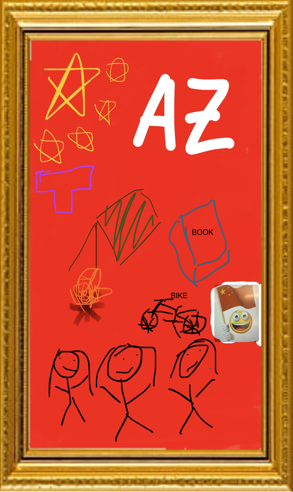

<section id="introduction"></section>
<!--gives td, or table data a white border of thickness 1 pixel-->
<!--setting background image, and making sure the site looks good and has enough space by expanding minimum height-->

<!--creates a section that can be hyperlinked, with id introduction, so if you want to make a link to it it would be "https://www.url.com/#introduction", can be used to go to different sections of a page-->  

<u>
<!--<u> underlines,  can be used similarly to 
 but can be used in between lines, while div is used in big chunks/blocks, div is used to make/mark sections (not the same as <section>)-->
    
    Matthew Wang's CSP Webserver
    
</u>

 

Hey, my name is Matthew Wang, welcome to my CSP Page! 
 

<!--<a> is a hyperlink, href is the link/website addon that will be activated when hyperlink is pressed. You can also put a button where it says "down to buttons..." to make it so you click a button to activate the link instead of clicking text-->
<ul>
<li><a id="godown" href="#aboutme">About me!</a></li> 
</ul>

               <section id="aboutme">
    
<a id="goup" href="#introduction">Back to Introduction...</a> 
Some things about me:
<!--<ul> = bulletted list, every content in <li> (list) will be bulletted -->
<ul>
<li>I was born in Arizona</li>
<li>I have three sisters, two of which graduated from DNHS</li>
<li>I enjoy reading, as well as playing games in my free time</li>
</ul>
Below is my freeform drawing!
 
<!-- tag, src = source, "path of image"-->

               
<!--creates a large separator line-->

        

<section id="accomplishments">
<b>Accomplishments</b>